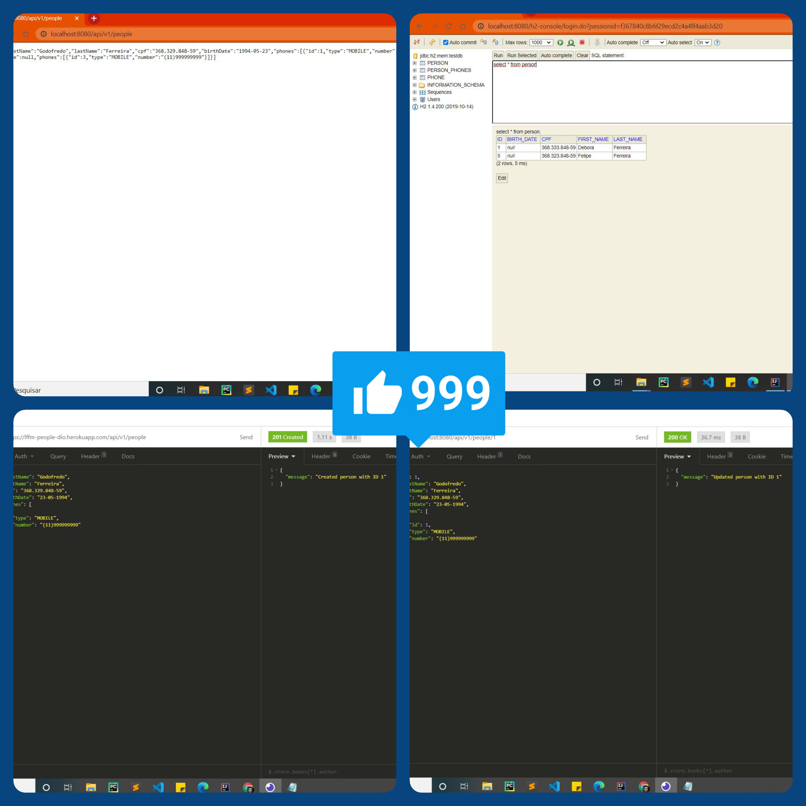

<h1 align="center">
    

</h1>

  <a href="#-tecnologias">Tecnologias</a>&nbsp;&nbsp;&nbsp;|&nbsp;&nbsp;&nbsp;
  <a href="#-projeto">Projeto</a>&nbsp;&nbsp;&nbsp;|&nbsp;&nbsp;&nbsp;
  <a href="#-layout">Layout</a>&nbsp;&nbsp;&nbsp;|&nbsp;&nbsp;&nbsp;

 

  

## 🚀 Tecnologias

Esse projeto foi desenvolvido com as seguintes tecnologias:

- Java 11 ou versões superiores.

- Maven 3.6.3 ou versões superiores.

- Intellj IDEA Community Edition ou sua IDE favorita.

- Controle de versão GIT instalado na sua máquina.

- Conta no GitHub para o armazenamento do seu projeto na nuvem.

- Conta no Heroku para o deploy do projeto na nuvem

  

## 💻 Projeto

API REST com Spring Boot para cadastro e gerenciamento de pessoas :person: de uma organização, até o deploy na nuvem (Heroku). 

